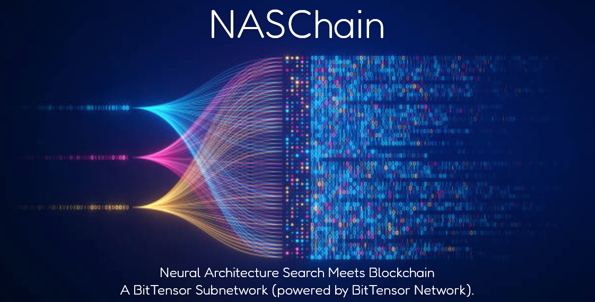

<div align="center">


---



[Discord](https://discord.gg/bittensor) • [Network](https://taostats.io/) • [Research](https://bittensor.com/whitepaper)
</div>

---
## Introduction

Neural Architecture Search (NAS) is a critical field in machine learning that focuses on automating the design of artificial neural network architectures. As deep nerual network models become increasingly complex and computationally expensive, the significance of NAS grows. The primary goal of NAS is to identify the optimal model that not only maximizes accuracy for a given use-case but also minimizes the number of parameters and the computational cost, measured in Floating Point Operations (FLOPs). However, performing such searches can be very resource-intensive, often requiring days or weeks of computation on hundreds of GPUs to find an optimal model.

NASChain aims to address these challenges by leveraging the power of the Bittensor network and an innovative incentive mechanism. This approach distributes NAS tasks among participants (referred to as miners), thereby decentralizing the computational effort and potentially reducing the time and resources required for finding efficient and effective neural architectures.

---
## How it works

1. **Miners Running NAS Algorithm:** Miners execute the Neural Architecture Search (NAS) algorithm on the dataset described by the sample mining code. The objective of the NAS is to minimize the number of parameters while maximizing accuracy on the test set. NSGA-Net based NAS models are supported by validators and provide a good starting point for miners to run multi-objective optimization.
 
   
2. **Model Submission:** Miners upload their best models to Hugging Face with the miner code and submit the metadata for the commit to the blockchain.

3. **Validation Process:** Validators sync with the blockchain, download all models from the miners, and evaluate them on the test set. Architectures that lie on the Pareto Optimal line will have their weights reset and undergo further training by validators on the standard train/valid set to ensure no test set leakage occurred during the miners' model training.

4. **Rewards for Miners:** Miners who produce models that lie on the Pareto Optimal line will be rewarded. Miners task is to train models that maximize accuracy on the test set and minimize the number of parameters.

<div align="center">

</div>


# Model Training and Validation Rules

### 1. Leaking Test Set to Training Set
Leaking the test set to the training set to gain higher accuracy when evaluated by the validators is considered cheating. Models selected as top models due to their high accuracy on the test set will have their weights reinitialized and retrained with a standard train-test split by the validators. If the submitted model's accuracy is lower than the accuracy achieved by retraining by the validator, the miner will be disqualified.

### 2. Overtraining the Model and Custom Hyperparameters
Please take some time to review `dummy_trainer.py`, `vali_trainer.py`, and `vali_config.py`. Follow the hyperparameters used for training, such as the number of epochs, optimizer, and learning scheduler. Validators will evaluate your model based on `vali_trainer.py` and `vali_config.py`. Your model should outperform other models under the same fair conditions. For example, if you train your model for 500 epochs and achieve 95% accuracy, but the validator only trains the model for 50 epochs before evaluation, your pre-evaluation and post-evaluation results will not match, resulting in disqualification.

### 3. Custom Layer Implementation Not Supported by PyTorch Load and Deserialize Functions
Your models should be loadable and trainable using the generic torch.load() or torch.jit.load() methods. Custom layer implementations that require a layer definition alongside the model weights are not currently supported unless TorchScript can successfully save and load the model.

### 4. Model File Size
NAS is about training small models. There is a file size limit that you can upload as described in `vali_config.py`. Uploading larger model sizes than the limit will be rejected by the validator code. Exceptions will also be thrown during miner model upload if the size exceeds the limit. This limitation is to prevent overloading the validator with models that have billions of parameters unnecessarily for the dataset.

### 5. Duplicate Uploads
If the same architecture is uploaded multiple times by the same or different miners and the model is on the Pareto Optimal line and needs to be rewarded, only the miner with the oldest commit date for that model will be rewarded. For example, if two models uploaded to the chain and HF have exactly 500k parameters and 90% accuracy, the miner that uploaded the model first will be rewarded for that model if it is the top model.

---

## Hardware Requirements

### Miners:
- **GPU**: Miners can select any open-source NAS algorithm to find the best architectures. The NAS project, depending on the design, can support single or multiple GPUs, giving the miner the ability to speed up the NAS runtime.
- **CPU**: If uploading .pt file offline. 


### Validators:

- **GPU**: RTX 4090 (required). The validator code uses a fixed seed number to create deterministic results and avoid fluctuations in the results. It is strongly recommended to use a Linux environment and the exact Python version and packages described below. 
- **CPU**: At least 24 cores. Slow or virtual CPUs slow down the data pipeline, resulting in underutilization of the GPU.

---
## Installation

We recommend using virtual environments such as Conda to manage and isolate your project dependencies.
- Packages such as pytorch should be installed exactly as described in requirements.txt for Validators.
- Ensure you have Python == 3.10.14 installed on your system.
- Both Miner and Validator code is only tested on Linux OS.
- It is advised to use a virtual environment to avoid conflicts with other projects or system-wide packages.

### Runing Miner and Validator

1. Clone the repository:
   ```bash
   git clone https://github.com/neuronlogic/NASChain
2. Navigate to the project directory:
    ```bash
    cd NASChain
3. if setting up virtual enviuuement(Skip this step if running python on system level):
    - if using conda:
        ```bash
        conda create --name myenv python=3.10.14
        conda activate myenv
    - if using venv
        ```bash
        python -m venv env
        source env/bin/activate
4. Install the required packages:
    ```bash
    pip install -r requirements.txt

5. **Running Miner:**
   1. Create a Hugging Face account.
   2. Create a token with write access(Hugging Face Setting->Tokens) and export it as an environment variable:
      ```bash
      export HF_ACCESS_TOKEN="YOUR_HG_WRITE_TOKEN"
      ```
   3. To run a miner and train a dummy model, use only your Hugging Face username for `--hf_repo_id`. A model repository under the name `naschain` will be automatically created:
      ```bash
      python neurons/miner.py --netuid 31 --wallet.name <wallet_coldkey_name> --wallet.hotkey <wallet_hotkey_name> --logging.debug --hf_repo_id <your_hf_repo_id>
      ```
   4. Run a Miner with a Pretrained(.pt) PyTorch Model (Model Exported by NAS in a Different Directory torch.save() or torch.jit.save()):
      ```bash
      python neurons/miner.py --netuid 31 --wallet.name <wallet_coldkey_name> --wallet.hotkey <wallet_hotkey_name> --logging.debug --hf_repo_id <your_hf_repo_id> --model.dir path/to/model/model.pt
      ```
   5. For testnet use uid 123 and --subtensor.network test 

6. **Running Validator:**
   1. Create wandb account. From use setting page copy you API token.
   2. Export the wandb env variable 
      ```bash
      export WANDB_API_KEY='you_wandb_API_key'
      ```
   3. Mainnet:
      ```bash
      python neurons/validator.py --netuid 31 --wallet.name <wallet_coldkey_name> --wallet.hotkey <wallet_hotkey_name>   --logging.debug --logging.trace
      ```
      Testnet:
      ```bash
      python neurons/validator.py --netuid 123 --wallet.name <wallet_coldkey_name> --wallet.hotkey <wallet_hotkey_name>  --logging.debug --logging.trace  --subtensor.network test
      ```